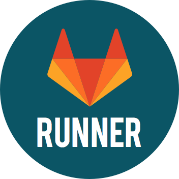
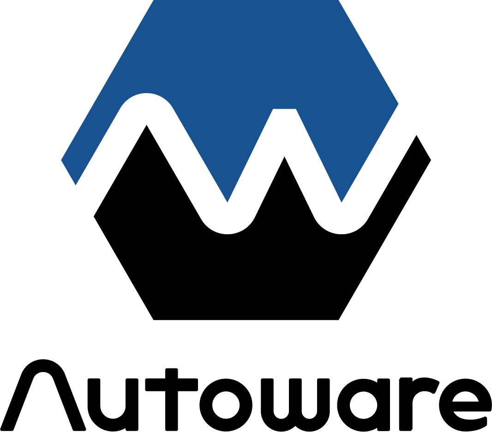

###  Hello! I'm oichokabu.

-  I'm Involved in Serverless Architecture, IaC, CI/CD, and IoT in Japan .
-  I'm currently working as a Cloud & Application Developer.
-  I'm interested in IoT, VR, AR, and AI.
-  I like Japanese anime. I often go to the cinema.
-  I like to play video games, especially the NieR series.
<!-- -  I am making Vocaloid songs in small pieces. -->
<!-- -  I have a Bachelor of Law degree. -->

<!--  -->

<!--  -->

###  Languages and Tools

    
    
    
    
    
    <!--  -->
    <!--  -->
    
    <!--  -->
    
    
    <!--  -->
    
    
    
    <!--  -->
    
    
    
    <!--  -->
    
    
    
    <!--  -->
    
    
    <!--  -->
    <!--  -->
    <!--  -->
    <!--  -->
    <!--  -->

